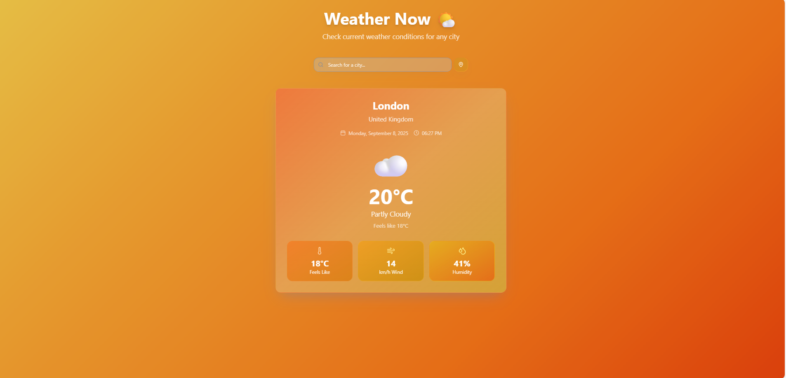

# 🌤️ Weather Now

A simple and responsive weather application that allows users to quickly check the current weather conditions for any city using the **Open-Meteo API**.

---

## ✨ Features
- 🔍 **Search Weather by City** – Enter a city name and get real-time weather data.
- 📍 **Geolocation Support** – Detect your current location weather.
- 🌡️ **Detailed Weather Info** – Temperature, weather condition, wind speed, and humidity.
- 🎨 **Dynamic UI** – Background changes based on weather conditions.
- 📱 **Responsive Design** – Works on both desktop and mobile.
- ⚠️ **Error Handling** – Display friendly messages for invalid inputs or network issues.

---

## 🛠 Tech Stack
- **React** – Frontend framework  
- **Tailwind CSS** – Styling  
- **Open Meteo API** – Weather data  
- **Open Meteo Geocoding API** – City to coordinates conversion  
- **Deployment** – Vercel / Netlify / GitHub Pages  

---

## 🌐 Live Demo
👉 [Click Here to View](https://kishanpandeyproject.netlify.app/)

---

## 📸 Preview



---

## ⚙️ Installation & Setup
Clone the repository and install dependencies:

```bash
git clone https://github.com/your-username/weather-now.git
cd weather-now
npm install
npm start
```

---

## 🔍 How It Works
1. Enter a city name in the input field.
2. The app uses **Open Meteo Geocoding API** to get latitude & longitude.
3. Fetches current weather from **Open Meteo Weather API**.
4. Displays weather details dynamically with UI updates.

---

## 🌐 API Used
- **Weather API:** [Open Meteo Weather](https://open-meteo.com/en/docs)
- **Geocoding API:** [Open Meteo Geocoding](https://open-meteo.com/en/docs/geocoding-api)

---

## 📂 Project Structure
```
weather-now/
├── public/
├── src/
│   ├── components/
│   │   ├── SearchBar.jsx
│   │   ├── WeatherCard.jsx
│   ├── App.js
│   ├── index.js
├── package.json
├── tailwind.config.js
```

---

## 🚀 Future Enhancements
- ✅ Dark Mode
- ✅ Feels Like Temperature
- ✅ Interactive Map View

---

## 🤝 Contribution
Feel free to fork this repository and submit pull requests for improvement.

---

## 📄 License
MIT License © 2025 **KISHAN PANDEY**

